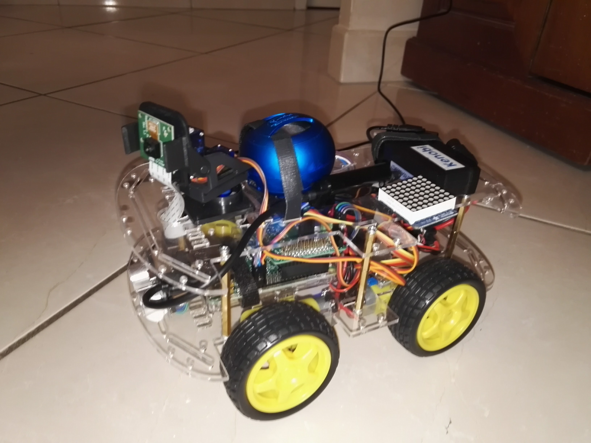
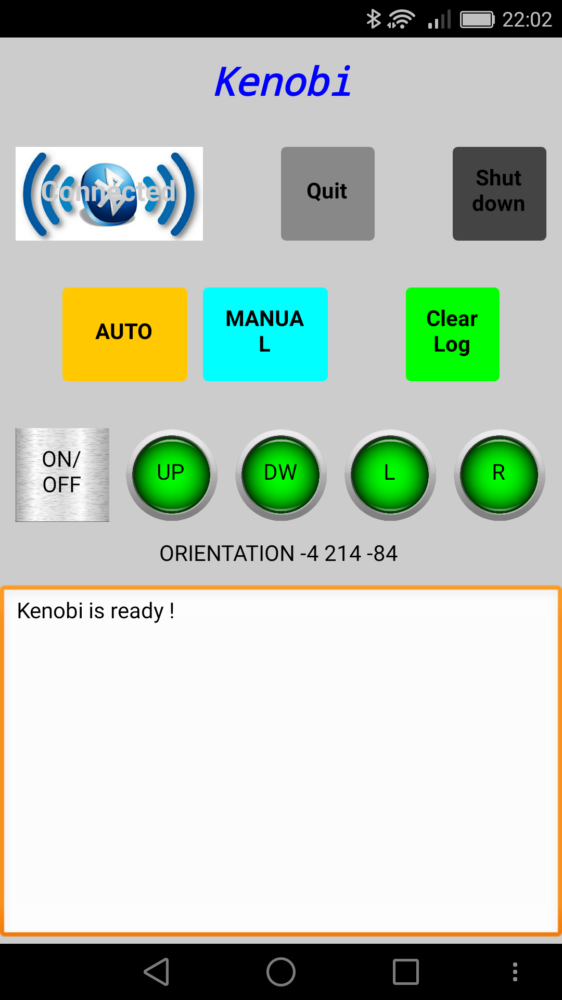
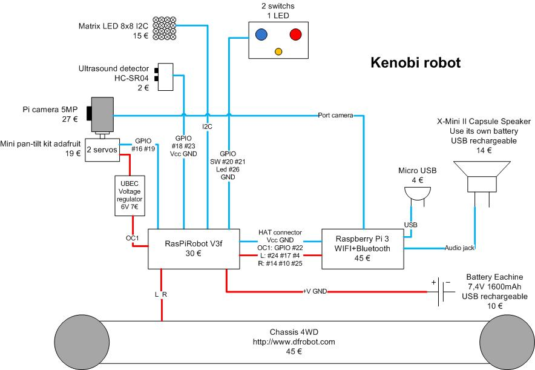

# Kenobi
Kenobi robot is developed in Python on a Raspberry Pi 3.



## Functions
1. **Google Assistant**, using the [Googla Assistant SDK for raspberry Pi](https://developers.google.com/assistant/sdk/prototype/getting-started-pi-python/)

2. **Driven mode via an Andoïd device** (Bluetooth connection), program created with [App Inventor](http://ai2.appinventor.mit.edu/?locale=en#4644884558643200)



3. **Autonomous mode**
- Move randomly
- Avoid obstacles using an ultrasonic sensor
- Display a beating heart
- Play droïd sounds

## Future functions
- Face recognition
- Targeting of a tennis ball

## Functional diagram



## Auto start-up

```
crontab -u pi -e
# add the line:
@reboot /home/pi/Kenobi/start_Kenobi.sh
```
